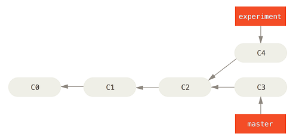
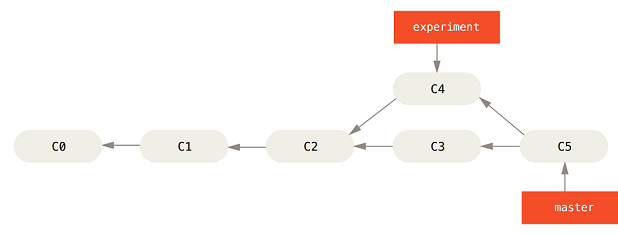
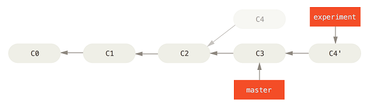

# Day 1

## Course Policies

[ClassPolicies.md](ClassPolicies.md)

## Git as a data store

Git at it's heart is just a way of storing data (in a usually inconvenient way)

### Blobs

If you do something like:

    $ echo 'test content' | git hash-object -w --stdin
    d670460b4b4aece5915caf5c68d12f560a9fe3e4

git can store arbitrary data as an blob in its store. The value it returns is the SHA-1 hash of the data. This is unique to the data stored, and it's how git addresses it's data. You can get the data out again like this:

    $ git cat-file -p d670460b4b4aece5915caf5c68d12f560a9fe3e4
    test content

So git is like a filesystem, except instead of filenames we have SHAs. Which are super-easy to remember - so that sounds great!

### Trees

The next thing that Git has is trees. Trees are a little like directory listings. Here's an example:

    $ git cat-file -p 70a3d925
    100644 blob 596faf6ccb2d0941fbb99b0725f247779a76eac0    .gitignore
    040000 tree e3297c52d84b1d6768ed5a5cbeecb4ccb09f429d    csse333
    040000 tree 006d7d4fedd63d34d810f10113fd3ea9f67790d7    csse403
    040000 tree 0852394a7e8134c88c7fb018800947d0b3910417    git
    100755 blob f254adc6b376555b159f897ebae97f35ff2b47f0    syncPublishedSECRET
    040000 tree d0bf0968c76d8e5609bd66d2a729c8d3c183df3b    ta_training

But what's fairly different about a tree than a directory structure is that the data is stored by SHA rather than name. So if any of the files in the tree were to change, the overall SHA of the tree would as well. For example here's the same tree revised:

    git cat-file -p 0382742282
    100644 blob 596faf6ccb2d0941fbb99b0725f247779a76eac0    .gitignore
    100644 blob e69de29bb2d1d6434b8b29ae775ad8c2e48c5391    COOL_NEW_FILE
    040000 tree e3297c52d84b1d6768ed5a5cbeecb4ccb09f429d    csse333
    040000 tree 006d7d4fedd63d34d810f10113fd3ea9f67790d7    csse403
    040000 tree 0852394a7e8134c88c7fb018800947d0b3910417    git
    100755 blob f254adc6b376555b159f897ebae97f35ff2b47f0    syncPublishedSECRET
    040000 tree d0bf0968c76d8e5609bd66d2a729c8d3c183df3b    ta_training

So the SHA of the tree represents the overall state of a directory. We can have multiple "versions" of a single directory state, each represented by a tree. AND if we consider there to be a "root" tree that's the parent directory tree of all the trees in our system, its SHA represents the overall state of every file and directory in our system.

And because of the way this is structured, no duplicate data is stored. That is a particular file or directory, if it is unchanged, will still have the same SHA, so it will be stored only once.

Using blobs + trees, we can recreate a whole directory structure if only we happen to know the SHA of the root tree. But still, remembering that SHA is not exactly trivial.

Next time: solution using commits.

## Plumbing 1 Assignment

[Look here](Homework/Plumbing1/)

# Day 2

## Brief review of last weeks stuff

Blobs:

file contents, stored by SHA

Trees:

    ~/git/js-parsons % git cat-file -p 4a218e805a
    100644 blob 52080ffd61a0b6b48edf8c4a19f2d43669532138    LICENSE
    100644 blob fd8a12c1e53c60ef952c7082908314e7c65c7ebf    README.md
    040000 tree 49bfccc8b774461aa705e2e9917530cdc0f96b2c    examples
    040000 tree c9a19fdb41ed9aa3c88ea062cd36b63ac1a131e9    lib
    100644 blob f4ba9e0fe4a997aa86c956c7d31c9375a699520a    parsons.css
    100644 blob 0dbf640b9a8ea3a3058f3a4f5935b25d6ed2f2f7    parsons.js
    040000 tree 5cbdcbbf7fedddfc18f9a451da5b2178d65c6281    tests
    040000 tree d40370126d7d0f49510a621055fd616a6081d8c6    ui-extension

list of blob SHAs and filenames. Represents the state of a directory. The tree of the repo root represents a filestate of an entire repo.

## Commits

Trees are almost enough to represent a repo. But we want a "commit"!

Commit = root repo tree + logistics + parent commit

    ~/git/js-parsons % git cat-file -p deeffdf08c7
    tree 4a218e805a4bc6a18b288f14f3673d652cbd5530
    parent f71110cd97eba01ab4b48bcdecbb7b4649b9d66c
    author Ville Karavirta <vkaravir@gmail.com> 1438200551 +0200
    committer Ville Karavirta <vkaravir@gmail.com> 1438200551 +0200
    
    Load jQueryUI touch punch and local jQ and jQUI in all examples

Logistics - who, when, and comment. Important stuff for tracking, but not hard to understand.

### Commit parent - this is how the history is represented!

A "linked list" of parents!

    ~/git/js-parsons % git log --pretty="%h - %s"
    deeffdf - Load jQueryUI touch punch and local jQ and jQUI in all examples
    f71110c - Add option and example to disable indentation
    c9950b1 - Clear feedback when changing toggles (#23)
    1e6b793 - Merge branch 'master' of github.com:vkaravir/js-parsons

### Merge commits have more than one parent

    ~/git/js-parsons % git log --pretty=format:"%h %s" --graph
    <SNIP>
    
       1e6b793 Merge branch 'master' of github.com:vkaravir/js-parsons
    |\
    | * 939a576 Fix output comparison in variablechecking
    | * c72f4a5 Updated Skulpt; new option to turtle grader
    | *   8d9663f Merge pull request #21 from vkaravir/vartest-feedback-fix
    | |\
    | | * ce0b906 Fix coloring of variable values in variable checker feedback
    <SNIP>
    
    ~/git/js-parsons % git cat-file -p 1e6b793
    tree 6b708450bde08628c526c341f4bcc8425961ce43
    parent 7e648132e08d7f98dcfa0accdc646a509fff0f1a
    parent 939a57617a490c8b9b8bf9cbf4194f3ed125c1d8
    author Ville Karavirta <vkaravir@gmail.com> 1426343275 +0100
    committer Ville Karavirta <vkaravir@gmail.com> 1426343275 +0100
    
    Merge branch 'master' of github.com:vkaravir/js-parsons

### How to create commits out of trees: commit-tree

    ~/git/js-parsons % git commit-tree 6b708450b -p 7e64813 -m "My comment"
    8f8b6527aa2cb7bf6d8fa74f814fad68b69d827e
    
    ~/git/js-parsons % git cat-file -p 8f8b6527aa
    tree 6b708450bde08628c526c341f4bcc8425961ce43
    parent 7e648132e08d7f98dcfa0accdc646a509fff0f1a
    author Buffalo <hewner@rose-hulman.edu> 1458143321 -0400
    committer Buffalo <hewner@rose-hulman.edu> 1458143321 -0400
    
    My comment

This is another plumbing command. Useful in learning and obscure special script writing - but in day-to-day usage stick with git commit.

### What about human readable names?

We now have everything we need storing the git repo history. We can even branch to our made up commits!

    ~/git/js-parsons % git checkout 8f8b6527
    Note: checking out '8f8b6527'.
    
    You are in 'detached HEAD' state. You can look around, make experimental
    changes and commit them, and you can discard any commits you make in this
    state without impacting any branches by performing another checkout.
    
    ~/git/js-parsons % git log --pretty=format:"%h %s"
    8f8b652 My comment
    7e64813 Minor css fixes to prevent misbehaving in some environments
    bebf70e Minor fixes to pseudocode, python variable handling, and executable code handling
    3a17c6e Merge pull request #19 from vkaravir/turtlet-grader
    b1b6576 Merge pull request #18 from vkaravir/python-exec-merge
    0c26a0f Merge pull request #17 from vkaravir/pseudo-toggle-fix

But still, having to remember the SHAs seems pretty dumb

## Refs: Git's human readable names for commits

    git update-ref refs/heads/mycoolname 8f8b6527

We can even look at the files themselves to verify this

And then things get even more interesting

    ~/git/js-parsons % git checkout mycoolname
    Switched to branch 'mycoolname'

### Branches are just refs

&#x2026;which is to say just human readable names for commit SHAs, which are just a tree + a previous

### Now you can understand!

From the explaination of git fetch:

"Fetch branches and/or tags (collectively, "refs") from one or more other repositories, along with the objects necessary to complete their histories. Remote-tracking branches are updated."

## Plumbing 2 Assignment

[<HomeworkCode/Plumbing2/Plumbing2.md>]

## An application: lost commits

This discussion is taken from here:

[<https://git-scm.com/book/en/v2/Git-Internals-Maintenance-and-Data-Recovery>]

### Step 1: in which you do something bad

    /tmp/js-parsons % git log --pretty=format:"%h %s" | head
    deeffdf Load jQueryUI touch punch and local jQ and jQUI in all examples
    f71110c Add option and example to disable indentation
    c9950b1 Clear feedback when changing toggles (#23)
    1e6b793 Merge branch 'master' of github.com:vkaravir/js-parsons
    
    /tmp/js-parsons % git reset --hard c9950b1
    HEAD is now at c9950b1 Clear feedback when changing toggles (#23)
    
    /tmp/js-parsons % git log --pretty=format:"%h %s" | head
    c9950b1 Clear feedback when changing toggles (#23)
    1e6b793 Merge branch 'master' of github.com:vkaravir/js-parsons

Later, you regret. But unfortunately by that point you've forgotten the SHAs of the removed commits.

### Step 2: check the reflog

    /tmp/js-parsons % git reflog
    c9950b1 HEAD@{0}: reset: moving to c9950b1
    deeffdf HEAD@{1}: clone: from https://github.com/js-parsons/js-parsons.git

The reflog shows your changes to HEAD. Ah ha! So we probably want deeffdf.

You can also see it in a more detailed way with

    git log -g

### Step 3: what if it's not in the reflog

An object somehow completely disconnected

    echo 'test content' | git hash-object -w --stdin

To check for unconnected stuff

    git fsck --full

    /tmp/js-parsons % git fsck --full
    Checking object directories: 100% (256/256), done.
    Checking objects: 100% (781/781), done.
    dangling blob d670460b4b4aece5915caf5c68d12f560a9fe3e4

### Step 4: Reconnect it to the ref tree

It it's a commit we can reconnect it

    git branch recover-branch deeffdf

Or heck, use our cool update-ref command

    git update-ref refs/heads/recover-branch deeffdf

# Day 3: Reset and Stash

## What is HEAD?

It is the commit you have currently checked out. Usually, that's the name of some branch. But critically, unless you haven't made any changes yet, it is a reference to the past.

### Example: Head in a normal state

    $ git log --pretty=oneline | head -3
    170148d94c677c506257552727d933b1d8313628 third commit
    2c2aafe37dcf7e26f7416636707d805412d1f79d second commit
    67e424e8afc47e6c1452edf63ac38769554f9ec3 first commit
    
    $ cat .git/HEAD
    ref: refs/heads/master
    
    $ cat .git/refs/
    heads/ stash  tags/
    
    $ cat .git/refs/heads/master
    170148d94c677c506257552727d933b1d8313628
    
    $ git cat-file -p 170148d94c
    tree fb2e2a93ab63fd2825b5fd090bd3c9648e8c6c04
    parent 2c2aafe37dcf7e26f7416636707d805412d1f79d
    author Buffalo <hewner@rose-hulman.edu> 1458494565 -0400
    committer Buffalo <hewner@rose-hulman.edu> 1458494565 -0400
    
    third commit

### Example: Head pointing a commit that does not have a branch name

    ~/git/testrepo % git log --pretty=oneline
    8dda548a1908a1b29a6f3b8671330b02eaf3ddab forth commit
    170148d94c677c506257552727d933b1d8313628 third commit
    2c2aafe37dcf7e26f7416636707d805412d1f79d second commit
    67e424e8afc47e6c1452edf63ac38769554f9ec3 first commit
    ~/git/testrepo % git checkout 2c2aafe37d
    Note: checking out '2c2aafe37d'.
    
    You are in 'detached HEAD' state. You can look around, make experimental
    changes and commit them, and you can discard any commits you make in this
    state without impacting any branches by performing another checkout.
    
    If you want to create a new branch to retain commits you create, you may
    do so (now or later) by using -b with the checkout command again. Example:
    
      git checkout -b <new-branch-name>
    
    HEAD is now at 2c2aafe... second commit
    ~/git/testrepo % cat .git/HEAD
    2c2aafe37dcf7e26f7416636707d805412d1f79d

Not that in this state if you use reset you won't modify any branches if you use reset. But usually the point of reset is to modify branches.

## Using checkout we can switch the branch head points to

    ~/git/testrepo % cat .git/HEAD
    ref: refs/heads/master
    ~/git/testrepo % git checkout otherbranch
    Switched to branch 'otherbranch'
    ~/git/testrepo % cat .git/HEAD
    ref: refs/heads/otherbranch

But we can't modify the contents of the branch with checkout.

We can modify it with commit, but that's obvious stuff.

With RESET we can modify the branch

## 3 Trees

There are 3 "trees" we might be interested

1.  The commit pointed to by head
2.  The INDEX of files ready to be committed
3.  All the files on your local filesystem

## Reset let's us change these things to match a particular commit

### git reset &#x2013;soft

Only modifies #1. Adjusts the branch to a new commit. But your local files don't change - so now they will appear like modifications.

Similarly, your staged changes will not be modified. This can be a little strange, because they'll still be staged. The diffs may be different, but the final state of the files will be as they were before.

Realize that this modifies the Branch! Not the same as checkout. If you push in this state (may require a &#x2013;force) you'll update the remote version of this branch too.

### git reset &#x2013;mixed (this is also the default)

Changes #1, like before.

Updates #2, to match #1. This removes all staged files (because they all match the commited version)

Again, your files will not be modified, but they might seem modified because the might no longer match the current head.

### Easy case: git reset &#x2013;hard

Destroys everything. Modifies 1 2 and 3, and forces them all to point to the same thing.

Very useful for blowing away unwanted stuff. But dangerous of course.

## 3 Trees and git checkout

So now we understand about the 3 trees, what about "git checkout <branch>". How does it affect the trees?

Checkout changes:

1.  The branch HEAD is pointing at
2.  Any files in the local filesystem that match HEAD will be switched to their version in the new head.

Changes (either staged or unstaged) are not affected - **which might not be what you expect**.

    ~/git/testrepo % ls
    firstCommit.txt  forthCommit.txt  secondCommit.txt  thirdCommit.txt
    ~/git/testrepo % echo "someChange" > forthCommit.txt
    ~/git/testrepo % echo "otherChange" > thirdCommit.txt
    ~/git/testrepo % git add thirdCommit.txt
    ~/git/testrepo % git status
    On branch master
    Changes to be committed:
      (use "git reset HEAD <file>..." to unstage)
    
            modified:   thirdCommit.txt
    
    Changes not staged for commit:
      (use "git add <file>..." to update what will be committed)
      (use "git checkout -- <file>..." to discard changes in working directory)
    
            modified:   forthCommit.txt
    
    ~/git/testrepo % git checkout otherbranch
    M       forthCommit.txt
    M       thirdCommit.txt
    Switched to branch 'otherbranch'
    ~/git/testrepo % git status
    On branch otherbranch
    Changes to be committed:
      (use "git reset HEAD <file>..." to unstage)
    
            modified:   thirdCommit.txt
    
    Changes not staged for commit:
      (use "git add <file>..." to update what will be committed)
      (use "git checkout -- <file>..." to discard changes in working directory)
    
            modified:   forthCommit.txt

### But sometimes you can't safely move branches and keep changes

    ~/git/testrepo % git checkout 2c2aafe37
    error: Your local changes to the following files would be overwritten by checkout:
            thirdCommit.txt
    Please, commit your changes or stash them before you can switch branches.
    error: Your local changes to the following files would be overwritten by checkout:
            forthCommit.txt
    Please, commit your changes or stash them before you can switch branches.
    Aborting

What's the problem? It's that the files thirdCommit and forthCommit don't exist in the commit we're moving to. The changes would be destroyed, and because git doesn't keep track of changes outside of commits, they'd be lost forever.

### Solution 1: Commit (and reset)

If you want to keep the changes associated with the branch you're on, it may be safer to just commit (even if you are unready). Remember with "git reset &#x2013;soft" you can always get you back in the previous state (mostly).

Example:

I've got a bunch of changes on a branch, and yet I need to change branches to work on a quick fix. My changes aren't ready for an official commit.

    git commit -a -m "BAD commit Work in Progress"

The -a stages all modifications and deletes.

Then I checkout what I need to work on

    git checkout 2c2aafe37

Works because now everything matches HEAD - I have no uncomitted changes.

I make my cool quick fix. Then I switch back:

    ~/git/testrepo % git checkout master
    Previous HEAD position was 2c2aafe... second commit
    Switched to branch 'master'
    ~/git/testrepo % git log --pretty=oneline
    e9b3c3fcace32b57fa1fa67a30dbec07eff82c7f BAD commit Work in Progress
    8dda548a1908a1b29a6f3b8671330b02eaf3ddab forth commit
    170148d94c677c506257552727d933b1d8313628 third commit
    2c2aafe37dcf7e26f7416636707d805412d1f79d second commit
    67e424e8afc47e6c1452edf63ac38769554f9ec3 first commit
    ~/git/testrepo % git reset --mixed HEAD~
    Unstaged changes after reset:
    M       forthCommit.txt
    M       thirdCommit.txt
    ~/git/testrepo % git status
    On branch master
    Changes not staged for commit:
      (use "git add <file>..." to update what will be committed)
      (use "git checkout -- <file>..." to discard changes in working directory)
    
            modified:   forthCommit.txt
            modified:   thirdCommit.txt
    
    no changes added to commit (use "git add" and/or "git commit -a")

Viola! Back to where I was. Only downside, I've lost track of which changes were staged and which were unstaged. Because I used &#x2013;mixed all changes are unstaged - if I used &#x2013;soft, they all will be staged.

### Solution 2: stash

See below

## Stash

stash let's you take a bunch of changes and store them in a strange list/stack.

    ~/git/testrepo % git status
    On branch master
    Changes to be committed:
      (use "git reset HEAD <file>..." to unstage)
    
            modified:   thirdCommit.txt
    
    Changes not staged for commit:
      (use "git add <file>..." to update what will be committed)
      (use "git checkout -- <file>..." to discard changes in working directory)
    
            modified:   secondCommit.txt
    
    ~/git/testrepo % git stash
    Saved working directory and index state WIP on master: 8dda548 forth commit
    HEAD is now at 8dda548 forth commit
    ~/git/testrepo % git status
    On branch master
    nothing to commit, working directory clean
    ~/git/testrepo % git stash list
    stash@{0}: WIP on master: 8dda548 forth commit

Calling git stash puts all changes into it's stack. Then at a later time you can execute

    git stash pop

To restore them.

Only thing is to remember that they exist and which stash corresponds to what.

### A Few extra arguments to stash

-m lets you set a special message for the stash

-k keeps any staged files intact, bit stashs unstaged files

-u includes untracked files

## Reset and Stash Assignment

[<HomeworkCode/ResetAndStash/ResetAndStash.md>]

# Day 4: Merging

## A Simple example

<https://git-scm.com/book/en/v2/Git-Branching-Basic-Branching-and-Merging>

## Merge Conflicts

The two branches both have changes to the same section of the same file.

    This file has several lines
    <<<<<<< HEAD
    Here are some branchone changes
    =======
    Here's some branch2 changes
    That span several lines
    >>>>>>> branch2
    Some future authors
    Might modify it
    In a way that could cause a merge conflict
    <<<<<<< HEAD
    branch1 added this line
    ======
    branch2 added this line
    >>>>>>> branch2
    That would be sad
    This line is added by branch2 but is not a conflict

Then intention is that you edit the file, combine the changes, and then test.

Once you have successfully merged the files, you must mark you are happy with the merged version by git adding:

    git add file_I_just_merged.txt

Once all conflicted files are merged, things can go through

## How merges work

If we were to just take 2 random commit states and diff them, we would get a ton of differences. But which of these are relevant and which are irrelevant?

Instead, what git does is it computes the nearest common ancestor of the two merging branches. Then a "diff" is constructed between each of the branch ends and this common ancestor. Then the diffs are "merged" and conflicts are detected. Any changes that don't conflict are automatically applied - changes that do are marked as conflicts for you to fix.

### Always test after merging

Note that small changes in one part of a computer program can affect distant parts. Just because there no conflicts doesn't mean the result works. Also attempt to compile and run unit tests before committing a merge commit.

## Fast-forward Merges

Sometimes when you merge, it turns out that one of the branches in the merge is an ancestor of the of the other. In this case, there's no possibility of conflict (because one of the diffs is empty). Moreover, the result of the merge is just going to be commit with the non-empty diff.

In this case, rather than actually creating a new commit, git will just adjust HEAD to point to the commit of that child branch. This frequently happens when:

1.  You are doing a pull, and you have no changes in your repo. Pull implicitly does a merge, but if you have no changes that will just move your head to the state of remote repo.
2.  You have done some tricky history editing with rebase (next class) which is intended to make merging really easy.

## Making your merging life easier

### Abort

    git merge --abort

Abandon all merge changes. Note that any changes you had before starting the merge will also be lost. Generally, don't do a merge with any changes uncommitted.

### Whitespace

    -Xignore-all-space
    -Xignore-space-change

Better solution: get your team on the same editor config

### Predetermine victor

    -Xours
    -Xtheirs

This only applies to CONFLICTS. Non conflicts will still be used.

    -s ours

Will create a merge branch that ignores the contents of the other merges. Usually something that would be better accomplished with a reset.

### Get more info for your merge

1.  The individual files

        git show :1:hello.rb > hello.common.rb
        git show :2:hello.rb > hello.ours.rb
        git show :3:hello.rb > hello.theirs.rb

2.  Changes since your last commit

        git diff --ours

3.  A more detailed conflict listing

        git checkout --conflict=diff3 hello.rb
    
        #! /usr/bin/env ruby
        
        def hello
        >>>>>>>> ours
          puts 'hola world'
        ||||||| base
          puts 'hello world'
        =======
          puts 'hello mundo'
        <<<<<<< theirs
        end
        
        hello()

## Assignment

[<HomeworkCode/Merge/merge.md>]

# Day 5: Rebase

## The Basics

Imagine we have created a branch "experiment" to try some new feature and we decide we want to incorporate the change into master. In the meantime though, a new commit has arisen on master:

What to do? Well, we could merge

But instead of that, we could do a **rebase**.

    $ git checkout experiment
    $ git rebase master
    First, rewinding head to replay your work on top of it...
    Applying: added staged command

Explanation from your textbook: It works by going to the common ancestor of the two branches (the one you’re on and the one you’re rebasing onto), getting the diff introduced by each commit of the branch you’re on, saving those diffs to temporary files, resetting the current branch to the same commit as the branch you are rebasing onto, and finally applying each change in turn.

## Rebasing with conflicts

Imagine I have a file that looks like this (944a5fa8):

    1. pirate
    2. ninja
    3. robot

Then in one branch I modify it to be this (fde4a8b):

    A. pirate
    B. ninja
    C. robot

While in another branch I capitalize it to Ninja (5a0e45a)

    2. Ninja

And then add some exclamation points 1ff0e8b

    2. Ninja!!!!

Ok, now let's rebase and add in the branch with the letters

    ~/git/testrepo % git rebase fde4a8b
    First, rewinding head to replay your work on top of it...
    Applying: capitalize ninja
    Using index info to reconstruct a base tree...
    M       firstCommit.txt
    Falling back to patching base and 3-way merge...
    Auto-merging firstCommit.txt
    CONFLICT (content): Merge conflict in firstCommit.txt
    error: Failed to merge in the changes.
    Patch failed at 0001 capitalize ninja
    The copy of the patch that failed is found in: .git/rebase-apply/patch
    
    When you have resolved this problem, run "git rebase --continue".
    If you prefer to skip this patch, run "git rebase --skip" instead.
    To check out the original branch and stop rebasing, run "git rebase --abort".

### Note that your changes are applied in order.  And may conflict partway

\#+BEGIN\_EXAMPLE <<<<<<< fde4a8bed620d0915b484b39de57fbca38817f50 A. pirate B. ninja C. robot `=====`

1.  pirate
2.  Ninja
3.  robot

>>>>>>> capitalize ninja \#+BEGIN\_EXAMPLE

So I fix it. Then I mark it as merged and continue

    ~/git/testrepo % git add firstCommit.txt
    ~/git/testrepo % git rebase --continue

### Then this can cause later conflicts

    ~/git/testrepo % git rebase --continue
    Applying: capitalize ninja
    Applying: put exclaimation points after ninja
    Using index info to reconstruct a base tree...
    M       firstCommit.txt
    Falling back to patching base and 3-way merge...
    Auto-merging firstCommit.txt
    CONFLICT (content): Merge conflict in firstCommit.txt
    error: Failed to merge in the changes.
    Patch failed at 0002 put exclaimation points after ninja
    The copy of the patch that failed is found in: .git/rebase-apply/patch
    
    When you have resolved this problem, run "git rebase --continue".
    If you prefer to skip this patch, run "git rebase --skip" instead.
    To check out the original branch and stop rebasing, run "git rebase --abort".
    
    ~/git/testrepo % cat firstCommit.txt
    <<<<<<< 30b23048c5b63ac3fc909e24bd5d4d980b78e63f
    A. pirate
    B. Ninja
    C. robot
    
    =======
    1. pirate
    2. Ninja!!!!
    3. robot
    >>>>>>> put exclaimation points after ninja
    
    ~/git/testrepo % emacs firstCommit.txt
    ~/git/testrepo % git add firstCommit.txt
    ~/git/testrepo % git rebase --continue
    Applying: put exclaimation points after ninja
    ~/git/testrepo % git log --oneline | head
    3de91ae put exclaimation points after ninja
    30b2304 capitalize ninja
    fde4a8b change numbers to letters
    944a5fa create list
    8dda548 forth commit
    170148d third commit
    2c2aafe second commit
    67e424e first commit

Not necessarily a bad thing, just what you ought to expect.

## Perils of rebasing

**Do not rebase commits that exist outside your repository**

&#x2026;or at the very least you do so at your peril.

Let's go through the example from here:

<https://git-scm.com/book/en/v2/Git-Branching-Rebasing>

## Is rebasing rather than merging a good idea?

Well, practically speaking, the actual business of creating software project is fairly messy. There is a large amount of out-of-order committing which will mean many small merges. As a result, looking at the history will be quite complicated.

This can be a real problem, as understanding what has happened can be real important part of source control. But a single conceptual "change" might be broken up among several commits with several merges.

So is that real history important, or do we want to have a curated understandable history.

In some places almost every "merge" is a rebase. These places tend to want to really have a beautiful understandable history (i.e. each commit represents a discrete understandable change). In other it's a very rare event.

## Rebase &#x2013;onto

Rebase in general can be thought of as

A) Batch up a bunch of commits as diffs B) Reapply them into a particular place

Still in progress&#x2026;

## Homework

[<HomeworkCode/RebaseVerbosely/RebaseVerbosely.md>]

## Note

Images and some text of the text of this lecture are taken from:

<https://git-scm.com/book/en/v2/Git-Branching-Rebasing>

# Day 6: Rewriting history

## amend

    git commit --amend

## interactive rebase

    git rebase -i HEAD~3

This command can be confusing because it really isn't much like a rebase (that is, it's not usually an alternative to merge though it can be if you rebase another branch).

Think about it for a second a realize there would be no point in git rebasing an HEAD~3 in most normal circumstances.

What git rebase -i does is transform commits into diffs, and then lets you apply them in whatever way you like.

### commit messages

say reword the commit you want to edit, the use git commit &#x2013;amend. It's not obvious, but editing the rebase list in the first view will not actually change the messages. It will take you to the real place later.

### squash

This one is pretty obvious from the help text

### editing commits

Note that it will dump you out, after the edited commit. So if you want to change things you have to use commit &#x2013;amend.

### splitting a commit

Say you want to do the opposite of squash &#x2013; you want to take a singular commit and split it into two separate commits. There's not direct command in interactive to do it, but you can easily use "edit" to do it by hand.

1.  

Take the commit you want to split and "edit" it in rebase interactive

    edit 310154e updated README formatting and added blame

1.  It's going to start you after the commit, so you must undo the commit:

    git reset HEAD^

This will leave the change unstaged.

    git add <WHATEVER>

Add what you want to be in the first commit.

    git commit 

Then repeat the process for the others. When you're finished, do a git rebase &#x2013;continue

## filter-branch

Your nuclear option

    git filter-branch --tree-filter 'rm bigfile.dat'

This is often what you need to do if a foolish person commits a large amount of binary files to your repo. But there are specialized tools for the particular case too.

## Warning: all of these things changes commit history

Don't revise history that others may be using!

## Cherry Pick

    git cherry-pick e4add8d

## Homework

[<HomeworkCode/HistoryRewrite/historyrewrite.md>]

# Day 7: Remotes and branches

## branch (basics)

    git branch
    git branch --list

List all local branches

    git branch newBranchName

Creates a new branch, pointing to HEAD. You still must checkout if you want to check it out though (or "checkout -b name" creates a branch and switches to it).

    git -m oldname newname

Rename a branch

    git -d name

Delete a branch

## branch & remote branches

    git branch -r

List remote-tracking branches

    git --set-upsteam-to remote-branch branchname

Sets a branch's upstream, which creates a default for push and pull and also shows the relationship between branches with git status.

## An aside: can I delete this branch?

Branch names are the way git knows to persist individual commit SHAs. So deleting a branch with changes that are not merged into an existing branch can mean that a particular SHA is no longer accessible and therefore could be garbage collected. As a result, git won't let you delete a branch with unmerged changes without the -f option.

However, if a branch is merged - now its history is persisted in the main branch. Assuming that it doesn't have a external "life" of its own (e.g. this is our development branch) it probably can be deleted.

## remotes

Remotes are other versions of the same repository that you're aware of.

    % git remote -v
    origin  /cygdrive/c/Users/Michael Hewner/ownCloud/Documents/hewner-cygwin/git/js-parsonsSECRET (fetch)
    origin  /cygdrive/c/Users/Michael Hewner/ownCloud/Documents/hewner-cygwin/git/js-parsonsSECRET (push)
    otherserver     https://github.com/js-parsons/js-parsons.git (fetch)
    otherserver     https://github.com/js-parsons/js-parsons.git (push)

You can add new ones to the list by using add

    git remote add otherserver https://github.com/js-parsons/js-parsons.git

Once you do that, you can use this as targets for fetch, pull, and push

    % git fetch otherserver 
    From https://github.com/js-parsons/js-parsons
     * [new branch]      codetranslations -> otherserver/codetranslations
     * [new branch]      java       -> otherserver/java
     * [new branch]      logging-fixes -> otherserver/logging-fixes
     * [new branch]      master     -> otherserver/master
     * [new branch]      pre-docs   -> otherserver/pre-docs
     * [new branch]      turtlet-grader -> otherserver/turtlet-grader
     * [new branch]      vartest-feedback-fix -> otherserver/vartest-feedback-fix
     * [new branch]      visualize_indentation_in_execution_mode -> otherserver/visualize_indentation_in_execution_mode

### origin

origin is a remote that is setup for you when you clone. It initially points to the server that you cloned from.

## fetch

This might look like it's making branches, but it's not.

    % git fetch otherserver 
    From https://github.com/js-parsons/js-parsons
     * [new branch]      codetranslations -> otherserver/codetranslations
     * [new branch]      java       -> otherserver/java
     * [new branch]      logging-fixes -> otherserver/logging-fixes
     * [new branch]      master     -> otherserver/master
     * [new branch]      pre-docs   -> otherserver/pre-docs
     * [new branch]      turtlet-grader -> otherserver/turtlet-grader
     * [new branch]      vartest-feedback-fix -> otherserver/vartest-feedback-fix
     * [new branch]      visualize_indentation_in_execution_mode -> otherserver/visualize_indentation_in_execution_mode
    
    /tmp/js-parsonsSECRET % git branch
     * master

It is updating "remote-tracking" branches. These are branches that git keeps representing the state of your remotes.

    /tmp/js-parsonsSECRET % git branch -r
      <stuff removed>
      origin/master
      origin/mycoolname
      origin/qqq
      origin/qqq2
      origin/turtlet-grader
      otherserver/codetranslations
      otherserver/java
      otherserver/logging-fixes
      otherserver/master
      otherserver/pre-docs
      otherserver/turtlet-grader
      otherserver/vartest-feedback-fix
      otherserver/visualize_indentation_in_execution_mode

These branches cannot be updated by you. They just track the state of the remote world. The reason they exist is so you can use them for your convenience. For example:

    git checkout otherserver/master

Puts you in a detached head state with whatever is currently master on otherserver.

    git merge origin/mycoolname

Merge your stuff with whatever is currently on origin's mycoolnamebranch

You can even make a local branch, designed to match some remote branch

    /tmp/js-parsonsSECRET % git checkout otherserver/logging-fixes
    /tmp/js-parsonsSECRET % git branch logging-fixes
    /tmp/js-parsonsSECRET % git checkout logging-fixes

## git pull

Pull is just a fetch, followed by a merge. So

    git pull origin/master

is just

    git fetch # update our view of the remote server
    git merge orgin/master # merge origin/master into this current branch

Note that this could quite reasonably cause a merge commit to be created, or even generate a merge conflict.

## upstream

Now normally you do git pull without specifying a remote branch.

    git pull

What that does is use the "upstream branch" as the default.

    git branch --set-upstream-to=otherserver/logging-fixes logging-fixes
    git pull

Each branch has its own upstream.

The reason you probably don't know about this is that when you clone, your branch is automatically setup with the cloned repository's active branch. This includes setting the upstream.

Also you can implicitly setup a branch that tracks a remote branch like this:

    % git checkout pre-docs
    Branch pre-docs set up to track remote branch pre-docs from otherserver.
    Switched to a new branch 'pre-docs' 

This only works if: a) the branch does not exist b) of all your remotes, only 1 has a branch with that name

I think this syntax is sort of unfortunate.

I like

    git checkout -b qqqqq otherserver/codetranslations --track

or

    git checkout otherserver/codetranslations --track

## git push

    git push origin master

This takes the local master and commits it to the remote master. If the branch master did not exist on the remote, it would create it.

If you want to make the branches different:

    git push origin localbranch:remotebranch

Or if you happen to have set the upstream

    git push

Also, this will by default only work if what is on your branch is a child of what is on the destination branch. If this is not true, you'll need to force it:

    git push -f

But remember - this is dangerous. Probably you should be fetching and then rebasing or merging. Forcing when you don't know what's on your destination can obliterate other's changes.

## Homework

[<HomeworkCode/PushAllBranches/PushAllBranches.md>]

# Day 8: gitconfig

A few hours customizing your dotfiles can pay off for years.

Like most unix programs, git takes its configuration from a config file located in the home directory. In this case, the .gitconfig file.

<https://git-scm.com/book/en/v2/Customizing-Git-Git-Configuration> <http://michaelwales.com/articles/make-gitconfig-work-for-you/>

## Setting on the command line

    git config --global core.editor emacs

Most of these commands can also be set via the command line. I don't reccommend you do it that way - instead, spend time building a git config that you can take with you from place to place.

## Gitconfig

### The Basics

### Your identity

    [user]
      email = hewner@rose-hulman.edu
      name = Buffalo

### Your editor

    [core]
      editor = emacs

Not always necessary to set, because git will use your $EDITOR shell value (which, BTW, you should already be setting correctly).

### Colors

By default, git is colorful. Or more accurately, git is colorful when it senses output is going to a terminal, not colorful when git is being piped into a unix command. This is usually what you want, because color characters can screw up scripts.

But you can customize individual colors to show specific stuff. For example:

    [color "branch"]
        current = yellow reverse
        local = yellow
        remote = green
    
    [color "diff"]
      whitespace = red reverse

This makes whitespace changes obvious.

It also makes the branch colors a little less jarring.

### Aliases

Write your own git commands!

    [alias]
        co = checkout
        check-master = !git fetch origin && git diff origin/master

Note that the ! in front of a command lets it run a random command line command. Does not even need to be a git command!

### Autocorrect

    [help]
           autocorrect = 10

Automatically runs misspelled commands.

### Garbage collection

    [gc]
      auto = 0
      reflogExpire = never
      reflogExpireUnreachable = never

### Specific command stuff

    [merge]
    	conflictstyle = diff3

Or you can identify special tools for diff and merge

    [merge]
      tool = mymeld
    
    [mergetool "mymeld"]
      cmd = $HOME/bin/meldmerge $BASE $LOCAL $REMOTE $MERGED

## git specific prompt

You can make your prompt display all sorts of useful data. In particular, you can make it display your current branch, if changes are current uncommitted etc.

Getting this setup by yourself is a major pain. I reccommend using something like oh-my-zsh for your individual shell which makes it easy to get really fancy custom prompts.

## Hooks

For details

<https://git-scm.com/book/en/v2/Customizing-Git-Git-Hooks>

But the basic idea is very simple

Hooks run before various stages of commits and updates. You can run arbitrary scripts.

## Homework

So your homework is to make your own personal .gitconfig. Take a look at the examples linked here, plus poke around on the internet, and get your .gitconfig the way you like it. Then submit it to me via moodle.

# Day 9: Git branching strategies

## Course Evals

-   This is a experimental course
-   I am very interested in your feedback
-   Be as honest and detailed as you can

## GitHub's strategy: Ultimate Simplicity

Taken from <http://scottchacon.com/2011/08/31/github-flow.html>

### There is one "magic" branch: master

What's on master should be stuff that will be deployed any minute now. Master represents the deployed or soon-to-be-deployed state of the system.

### You make your own small feature branches

Your name them whatever you like. You push them to the shared repo with the same name. When the time comes for them to be code reviewed, you submit pull requests. When your reviewer signs off, your change is pushed to master.

Then you deploy them to production immediately.

### Pros

Simplicity. But simplicity is quite good.

### Cons

This system is designed for small independent features that can easily be tested.

1.  Small

    Imagine in this system certain changes require a DB migration that takes 5 hours to do. This would be incredibly dangerous! The change must be on master because otherwise its not code reviewed. But if another change gets pushed while the DB migration is running, it might deploy the DB-dependent changes to master.

2.  Independent

    There is no concept here of interdependent features that need each other to be safely deployed. Of course, that could be accomplished by shared branches of some sort or another, but this system is left unspecified.

3.  Easily be tested

    There's no provision here for keeping a stable "good state" to allow for testing

## Git Flow: Releases that Aggregate Changes

Based on <http://nvie.com/posts/a-successful-git-branching-model/>

### There are two magic branches: develop and release

1.  Develop: where features we want to get deployed go

    Things on develop are ready for production. But they won't go out for a while. They might have dependencies on some features which aren't finished. You might call this "integration"

2.  master: the state of production

    This represents what's currently in production (or maybe will be in a minute or two)

### Supporting branches

1.  Feature branches

    From develop to develop
    
    The doc says this is on local computers, but that is fairly odd IMHO
    
    They also disallow fast forward merges, to preserve the memory of the branch

2.  Release branches

    From develop to (develop and master)
    
    When it's time to do a release we take what is in develop and we make a release branch. Henceforth, only bugfixes (and release specific stuff) are applied to that branch. Then when its ready, this will be pushed to master (and also to develop to get the bugfixes).

3.  Hotfixes

    From master to (master and develop)
    
    An emergency fix that needs to be made to production. Based off master because master is what's in production.

## Cool comparison (future reading)

<https://www.atlassian.com/git/tutorials/comparing-workflows/forking-workflow>

## No homework

You're done for the term!
